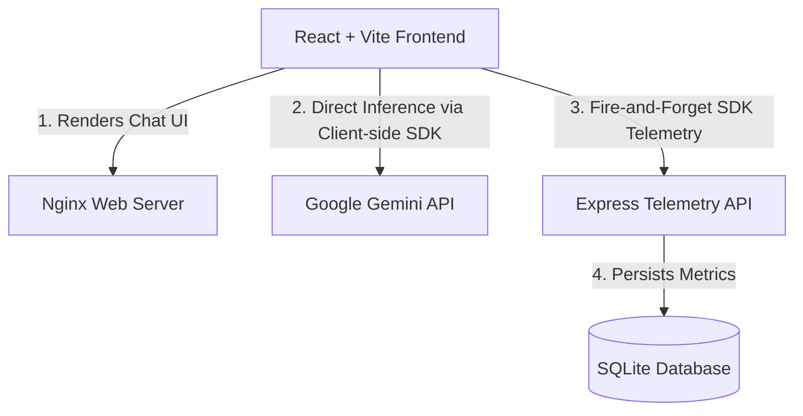

# Ollive Chatbot 🌿

An elegant, developer-first React + Vite chatbot interface powered by **Gemini 2.5 Flash**, featuring a built-in telemetry ingestion backend that tracks and logs model performance, latency, status, and token usage in real time.

---

## 🔗 Deployed Links

* **Frontend UI (Vite)**: `https://humble-harmony-production-b931.up.railway.app`
* **Telemetry API (Express)**: `https://ollive-chatbot-production-f369.up.railway.app`

---

## 🏗️ Architecture Overview

Ollive is structured as a lightweight monorepo comprising a modern client-side single-page application and a simple Express API server.



### Key Components:
1. **Frontend (`/src`)**: A high-performance React application bundled with Vite. It interacts directly with the Google Gemini API client-side for low-latency responses, saving your API key locally in `localStorage` for privacy and ease of setup.
2. **Telemetry Wrapper (`src/llm-wrapper.js`)**: A wrapper around the `@google/generative-ai` SDK. It intercept messages, tracks response times (latency), extracts token counts from response metadata, captures status/errors, and silently transmits logs to our telemetry server.
3. **Backend (`/server`)**: A lightweight Node/Express server that exposes a validation-guaranteed endpoint (`/api/logs`) to persist telemetry metrics.
4. **Database (`/server/telemetry.db`)**: A localized, highly efficient SQLite database backed by a persistent storage volume.

---

## 💾 Schema Design Decisions

I structured our telemetry database into three relational tables:

```
  ┌───────────────┐         ┌───────────────┐         ┌──────────────────┐
  │   sessions    │         │   messages    │         │  inference_logs  │
  ├───────────────┤         ├───────────────┤         ├──────────────────┤
  │ id (PK)       │───┐     │ id (PK)       │───┐     │ id (PK)          │
  │ created_at    │   │     │ session_id    │   │     │ message_id (FK)  │
  └───────────────┘   └────▶│ role          │   └────▶│ model            │
                            │ content       │         │ provider         │
                            │ created_at    │         │ latency_ms       │
                            └───────────────┘         │ prompt_tokens    │
                                                      │ completion_tokens│
                                                      │ total_tokens     │
                                                      │ start_time       │
                                                      │ end_time         │
                                                      │ status           │
                                                      │ error_message    │
                                                      │ created_at       │
                                                      └──────────────────┘
```

### Table Breakdown:
* **`sessions`**: Groups conversations. Each chat window session receives a unique `sessionId` (UUID) client-side. This keeps user histories distinct without requiring authentication.
* **`messages`**: Stores individual conversation turns (both `user` inputs and `model` outputs) linked to a parent session.
* **`inference_logs`**: Tracks specific LLM metrics (e.g. latency, token counts, status, error details) mapped directly to the model's generated response `message_id`.

### Why this design?
1. **Rich Observability**: Separating raw messages from `inference_logs` allows us to isolate conversational data from performance metrics while keeping them linked. You can query performance metrics without bloating message history queries.
2. **Fail-Safe Robustness**: If model generation throws an error, the backend still creates a session entry, records the user's prompt, and logs the generation failure (including the error message) inside `inference_logs`.

---

## 🛠️ Setup Instructions

### Local Development (Classic Node.js)

#### 1. Start the Telemetry Backend
```bash
cd server
npm install
npm run dev # Starts the backend on http://localhost:3000
```

#### 2. Start the Frontend
```bash
# Open a new terminal in the root directory
npm install
npm run dev # Starts the frontend on http://localhost:5173
```
Open `http://localhost:5173` in your browser, click the gear icon ⚙️, paste your Gemini API Key, and start chatting!

---

### Local Development (Docker Compose)

If you prefer containerized development, both services can be run simultaneously with a single command:
```bash
docker compose up -d
```
* Frontend will be accessible at `http://localhost:5173`
* Backend will be accessible at `http://localhost:3000`

---

### Cloud Deployment (Railway)

Ollive is optimized for a dual-service setup in a single **Railway** project canvas.

#### 1. Push your code to GitHub
Make sure your latest codebase is pushed to your remote repository.

#### 2. Deploy the Backend API (`ollive-backend`)
1. Click **+ New Project** ➡️ **Deploy from GitHub**.
2. Select your repository.
3. In settings, configure:
   * **Service Name**: `ollive-backend`
   * **Root Directory**: `/server`
4. Add these **Environment Variables**:
   * `PORT`: `3000`
   * `DB_DIR`: `/app/data`
5. Under **Settings** ➡️ **Networking**, generate a public domain and copy it.
6. Click **+ Add** (top-right) ➡️ **Volume**, set the mount path to `/app/data`, and click **Attach** *(this prevents your SQLite DB from getting erased on restarts)*.

#### 3. Deploy the Frontend UI (`ollive-frontend`)
1. In the same project canvas, click **+ New** (top-right) ➡️ **GitHub Repo**.
2. Select the same repository.
3. In settings, configure:
   * **Service Name**: `ollive-frontend`
   * **Root Directory**: `/`
4. Add this **Environment Variable**:
   * `VITE_API_URL`: `<YOUR_BACKEND_PUBLIC_DOMAIN_FROM_STEP_2>` (e.g., `https://ollive-backend.up.railway.app`)
5. Under **Settings** ➡️ **Networking**, enter port `80` and generate your public UI domain.

---

## ⚖️ Tradeoffs Made

### 1. Direct Client-side API Calls vs. Server-side Proxying
* **Tradeoff**: I instantiate the Gemini SDK directly in the client browser, storing the user's API key in browser `localStorage`.
* **Pros**: Zero backend hosting costs for LLM inference. High security/privacy because the developer doesn't handle or pay for the users' API tokens.
* **Cons**: We cannot secure or hide our own API key behind a backend route. Users must supply their own API keys in the settings panel to interact with the bot.

### 2. SQLite vs. Distributed Databases (PostgreSQL / MongoDB)
* **Tradeoff**: Used SQLite instead of a dedicated server-based database.
* **Pros**: Zero-config, zero database server costs, and extremely fast read/write times for single-node setups. Telemetry logs are stored in a single `.db` file.
* **Cons**: Limited horizontal scaling. If our backend ever needs multiple replica containers for load-balancing, SQLite cannot be shared across nodes unless backed by complex tools like LiteFS.

---

## 🚀 What I Would Improve With More Time

1. **Secure API Key Proxying**: Implement a backend route in the Express server to proxy the Gemini API calls. This would allow us to securely hide developer-owned API keys, offer a seamless "free out-of-the-box" user experience, and apply usage quotas/rate-limits to avoid billing abuse.
2. **Real-time Analytics Dashboard**: Build a `/dashboard` UI route showing latency heatmaps, token usage statistics over time, model error rates, and average response times.
3. **Database Migration to PostgreSQL**: For real production scaling, migrate the database layer to a hosted PostgreSQL instance, removing the need for a localized persistent volume mount and enabling replica scaling for the API server.
4. **Enhanced Error Alerts**: Wire up the telemetry logger to third-party monitoring (like Sentry or Discord webhooks) to immediately notify developers when the LLM throws a `5xx` rate-limit or API key exhaustion error.
5. **Comprehensive Test Suite**: Implement unit tests for the SDK wrapper (`llm-wrapper.js`) to guarantee latency capture precision, and Cypress/Playwright integration tests to cover various model failure states.
